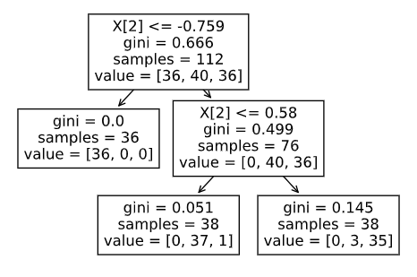

# GRIP DECEMBER 2020
## Task: Prediction using Decision Tree Algorithm
>By Parth Mistry

* Created a model which will predict the type of iris plant.
* Used decision tree algorithm to achieve the maximum accuracy.
* The dataset has three iris species with 50 samples each as well as some properties about each flower. One flower species is linearly separable from the other two, but the other two are not linearly separable from each other.

* The columns in this dataset are Id, SepalLengthCm, SepalWidthCm, PetalLengthCm, PetalWidthCm, Species

* The solution problem: Multiclass Classification using Decision Tree
* This project was a part of my internship at The Sparks Foundation as a Data Science and Business Analytics Intern.
* Built a pipeline to carry over the task.  
---
## Code and Resources Used
**Python Version:** 3.7  
**Packages:** pandas, numpy, sklearn, matplotlib, seaborn  
**Dataset:** [Link to download](https://bit.ly/3kXTdox)  

---
## Exploratory Data Analysis  

  

---
## Model And Pipepline Building
 * The pipeline contained two parts:  
    1. Firstly, we need to scale the data. Therefore we will use the Standard Scalar from sklearn.preprocessing  
    2. Secondly. We will create a Decision Tree Classifier to classify the data from sklearn.tree

```
Pipeline(steps=[('standardscaler', StandardScaler()),
                ('decisiontreeclassifier',
                 DecisionTreeClassifier(max_depth=2))])
```
---
## Model Evaluation

**Training Accuracy** = 0.9553571428571429  
**Test Accuracy** = 0.9736842105263158  

---
## Tree Visualization

